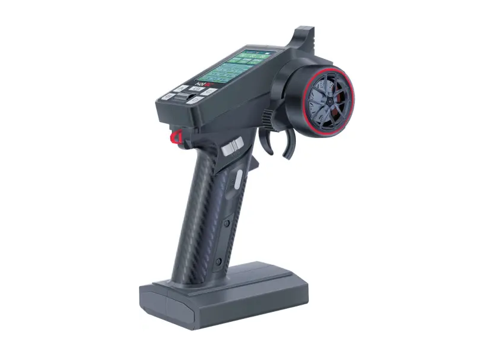
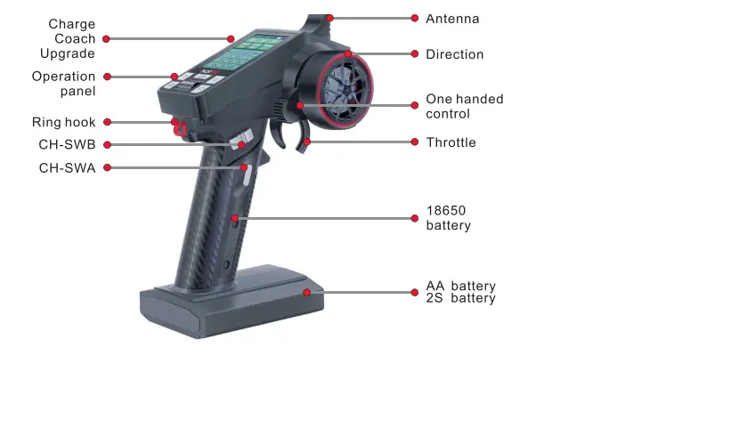
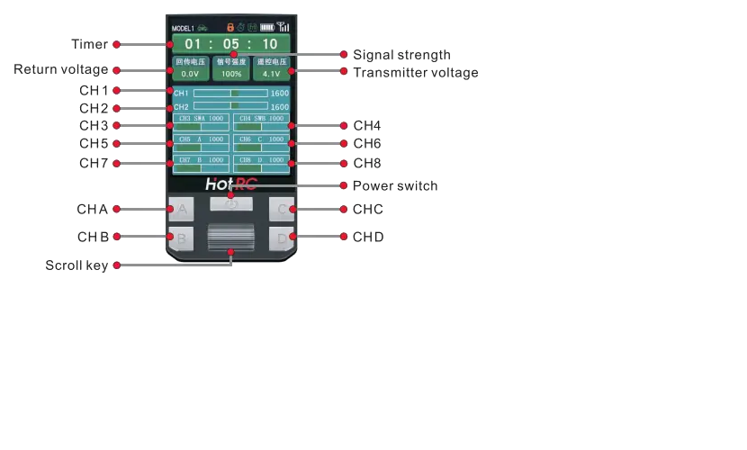

# Plan for Building an RC Car Real-Time Transmitter with Linuxcnc simulator game

## Requirement Details 
Transmitter and Receiver  (8 channel)
Arduino Uno( 14 digital pins (0 to 13))
Linuxcnc

## block diagram

+------------------+

|    Transmitter   |

+------------------+

         |

         v

+------------------+

|  Arduino Uno I/O |

+------------------+

         |

         v

+------------------+

|   LinuxCNC hal   |

+------------------+

         |

         v

+------------------+

|   LinuxCNC gui   |

+------------------+

         |

         v

+---------------------------+

|   Debian Remap Keyboard   |

+---------------------------+

         |

         v

+------------------+

|   Car game       |

+------------------+

# HotRC

**`HOTRC CT-8A 2.4G:`**

**`PRODUCT:`**

**`Receiver_parameters:`**

