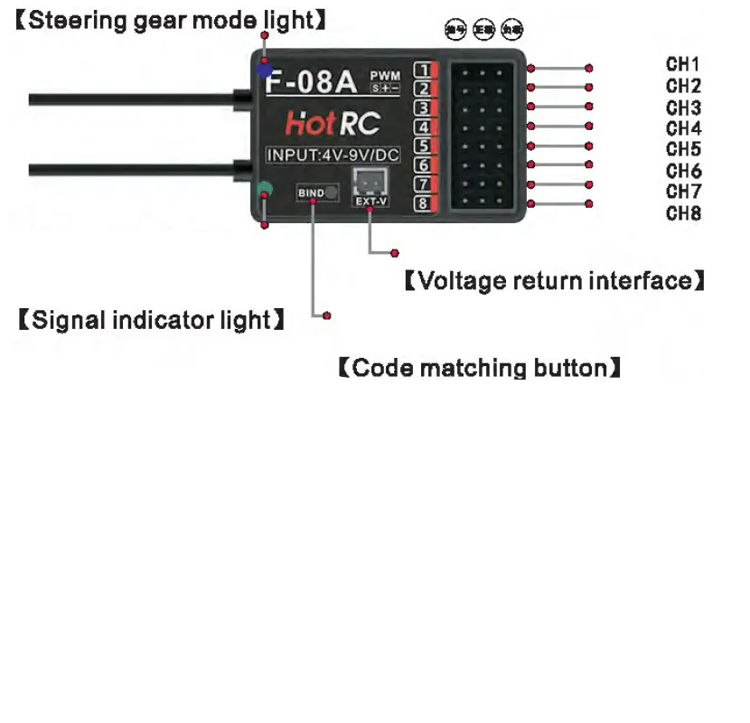
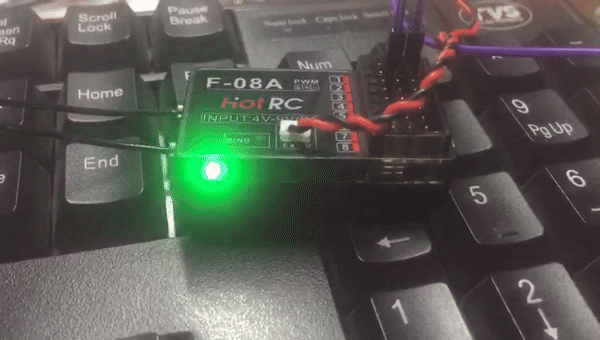
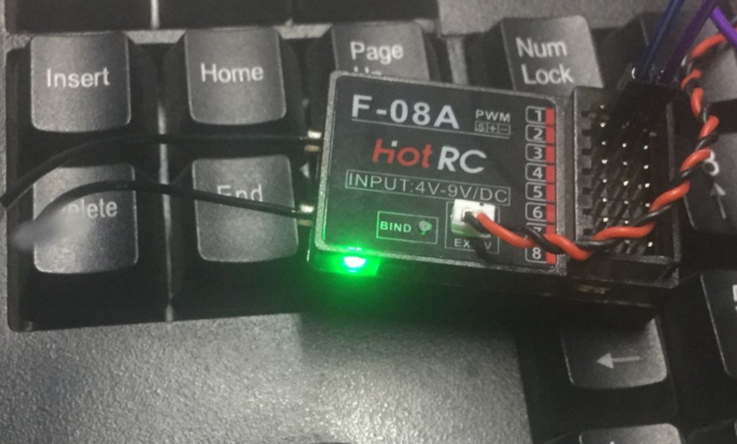
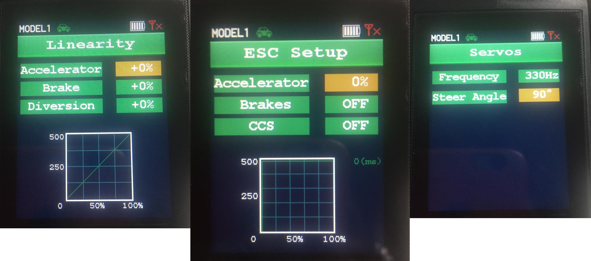
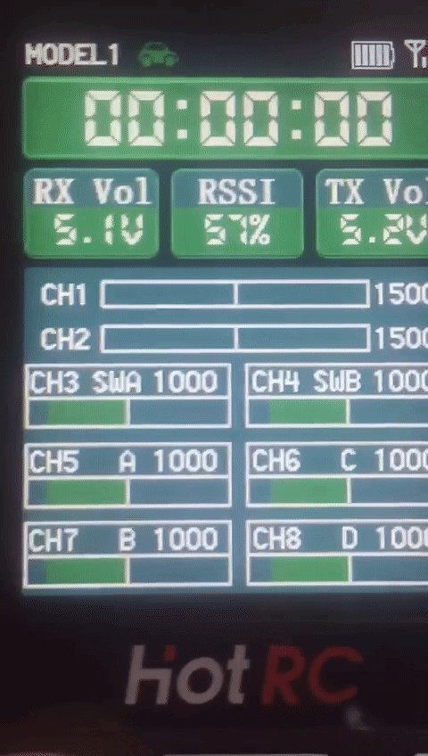
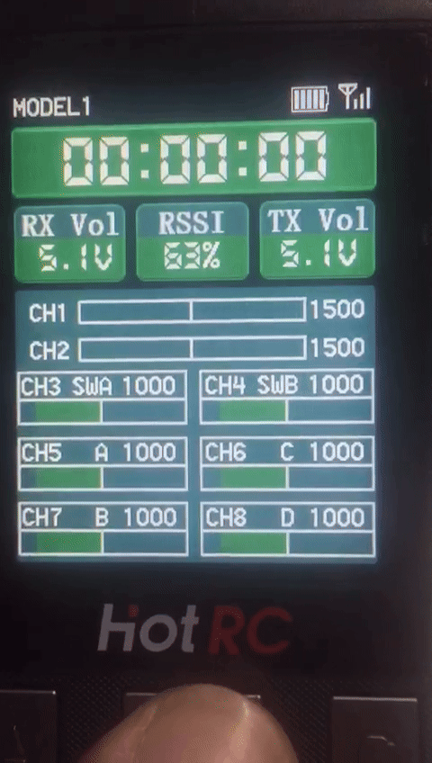

# Plan for Building an RC Car Real-Time Transmitter with Linuxcnc simulator game

## Requirement Details 
Transmitter and Receiver  (8 channel)
Arduino Uno( 14 digital pins (0 to 13))
Linuxcnc

## block diagram

+------------------+
|    Transmitter   |
+------------------+
         |
         v
+------------------+
|  Arduino Uno I/O |
+------------------+
         |
         v
+------------------+
|   LinuxCNC hal   |
+------------------+
         |
         v
+------------------+
|   LinuxCNC gui   |
+------------------+
         |
         v
+---------------------------+
|   Debian Remap Keyboard   |
+---------------------------+
         |
         v
+------------------+
|   Car game       |
+------------------+

# HotRC

**`HOTRC CT-8A 2.4G:`**

**`PRODUCT:`**

**`Receiver_parameters:`**

--------------------------

Coding method one:

    A. Power on the receiver first;
    
    B. Press the receiver [BING] button again;
    
    C. Finally, turn on the transmitter power.

Coding method two:

    A. Both the receiver and transmitter are powered on;
    
    B. Press the receiver [BING] button again;
    
    C. Enter the remote control code matching page to perform code matching.

**`slow_blink:`**

0.3seconds × 1,000 milliseconds/second = 300  milliseconds

**`fast_blink:`**

**`paired_to_receiver:`**

**`trigger_[CH2].png:`**

![trigger_[CH2].png](png/HOTRC_CT_8A_2.4G/trigger_[CH2].png)

**`Linearity_ESCSetup_servos:`**

**`Button_A_B_C_D:`**

## Turn off the receiver first, then turn off the transmitter.

**`Tips:`**

https://hackmd.io/@prooma/HyCKuGmGa

Power switch: long press to turn on and off, short press to return.

Scroll key: Scroll up and down to select, short press to confirm; 

Scroll key : Stopwatch: (system menu (5) --- > timer (3) --- > state (ON))
press and hold to pause during timing, and press and hold again to clear timing.

    
    
https://manuals.plus/hotrc/ct-8a-2-4g-radio-remote-control-manual

Types of buttons

Puss butoon
 It can be momentary (returns to its default state after release) 
Examples:

    Physical Buttons: Like those on keyboards, remote controls, or appliances.
    
    
Toggle Button

The button retains its state until it is toggled again.

Examples:

    On/Off Switch: A common example is a switch that turns a feature or setting on or off.

Three States: (SWB)

On/Off: Most slide switches are used for binary states (e.g., ON and OFF).
In some designs, a slide switch might include an additional middle position, such as ON, OFF, and a third position like a "Neutral" or "Middle" state.

Example of Three-State Slide Switch:

    Position 1: ON
    Position 2: Middle (e.g., a neutral or standby position)
    Position 3: OFF

