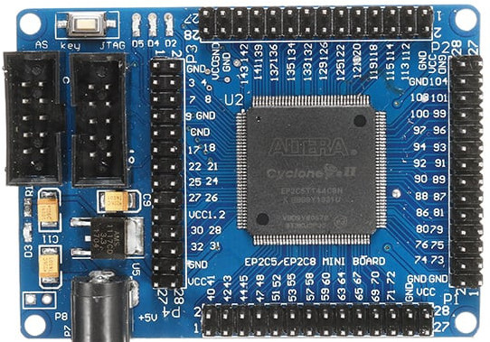
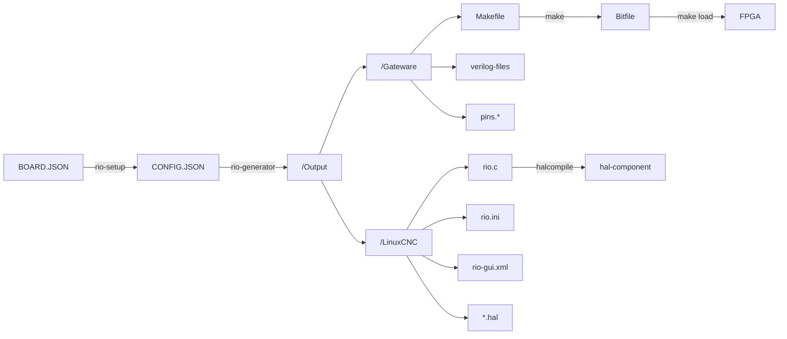

# How to control linuxcnc via FPGA board Cyclone II (EP2C5T144)

## software_requirement:

### 1st need to install quartus design software:

### Intel® Quartus® II Web Edition Software


## download link

https://www.intel.com/content/www/us/en/software-kit/711790/intel-quartus-ii-web-edition-design-software-version-13-0sp1-for-linux.html


## checksum

sha1sum Quartus-web-13.0.1.232-linux.tar

2b110eff0d544bcda4013e265f6feaa507482357  Quartus-web-13.0.1.232-linux.tar


# basic Study FPGA

https://www.youtube.com/watch?v=o29SnVsLhOs

https://www.youtube.com/watch?v=vmraRVxKYss
https://www.youtube.com/watch?v=le6Jo5DpLao&ab_channel=TreyDahlberg

https://digilogicelectronica.wordpress.com/2016/07/15/altera-cyclone-ii-ep2c5t144-fpga/
https://digilogicelectronica.wordpress.com/2016/06/02/placa-de-desarrollo-fpga-ep1c3t144/


## How to install LinuxCNC-RIO

https://github.com/multigcs/LinuxCNC-RIO


#
```
git clone "https://github.com/multigcs/riocore.git"


python3 -m venv linuxRio
source linuxRio/bin/activate

```


##  Install Dependencies from requirements.txt

```
cd riocore
pip install -r requirements.txt 
pip install -r requirements-dev.txt
```


## RUN
```
export PATH=$PATH:/home/sab/altera/13.0sp1/quartus/bin
PYTHONPATH=. bin/rio-setup
```


then ---> select no:8 [EP2C5T144]
     ---> Load existing config  --> goto configs folder open [EP2C5T144]  ---> then select config.json
     
     


## SOF (SRAM Object File)

   - Purpose: Used for temporary configuration of FPGAs.
   - Storage: Designed to be loaded into the FPGA's SRAM on power-up or via JTAG.
   - Volatility: Configuration is lost when power is turned off.
   - Usage: Typically used during development and testing.

## POF (Programming Object File)

   - Purpose: Used for permanent configuration of FPGAs.
   - Storage: Can be stored in non-volatile memory (like flash) for long-term retention.
   - Volatility: Configuration persists after power is turned off.
   - Usage: Commonly used for final production configurations.


--------------
Check Available Cables: Before running the command, check which programming cables are available:

1) USB-Blaster variant [1-7]


/home/sab/altera/13.0sp1/quartus/bin/quartus_pgm -l

--------------

problem with permissions

/home/sab/altera/13.0sp1/quartus/bin/jtagconfig
1) USB-Blaster variant [1-7]
  Unable to lock chain (Insufficient port permissions)


try lsusb ---?? Bus 001 Device 009: ID 09fb:6001 Altera Blaster


sudo usermod -aG dialout $USER
sudo chmod 666 /dev/bus/usb/001/009  # Replace with your actual device path


----------------------------


Try Me: 2


OpenFPGAloader


https://github.com/trabucayre/openFPGALoader


Try_MET: 3


export PATH=$PATH:/home/sab/altera/13.0sp1/quartus/bin
quartus_sh --convert -o svf --from your_project.sof --to your_project.svf


sab@SH4D0W6:~/Desktop/TRY_BUILD/openFPGALoader/build$  sudo ./openFPGALoader -c usb-blaster --detect


empty
index 0:
	idcode 0x20b10dd
	manufacturer altera
	family cyclone II
	model  EP2C5
	irlength 10


Store temp only

openFPGALoader -c usb-blaster -m rio.svf
empty
write to ram
USB-BlasterI has a 24MHz fixed frequency
end of SVF file


Try new add -f

openFPGALoader -c usb-blaster -m rio.svf -f


# 	quartus_cpf -c --operation=p --freq=6MHz --voltage=3.3V $(PROJECT).sof $(PROJECT).svf

export PATH=$PATH:/home/sab/altera/13.0sp1/quartus/bin
quartus_cpf -c --operation=p --freq=6MHz --voltage=3.3V rio.sof rio.svf


# not support Cyclone II

https://trabucayre.github.io/openFPGALoader/compatibility/fpga.html

https://www.intel.com/content/www/us/en/support/programmable/articles/000083054.html
https://www.01signal.com/vendor-specific/intel/fpga-command-line-jtag/
https://www.reddit.com/r/FPGA/comments/kb1jq4/quartus_hardware_setup_using_cli/
https://www.intel.com/content/www/us/en/docs/programmable/683118/current/quartus-pgm-nios2-command-line-examples.html


## bugs:

quartus: error while loading shared libraries: libpng12.so.0: cannot open shared object file: No such file or directory
https://gist.github.com/remlapmot/2431ebf7b8ca07bfbfbbca97fd1a5cca


## Gathering PIN details from schematics.


### JTAG (Joint Test Action Group)

Temporary: Configuration lasts until power is cycled.


### AS (Active Serial)
Permanent (until reprogrammed): Configuration is stored in non-volatile memory and persists after power-off, loading automatically on startup. You can reprogram it when needed.


## try this in windows cmd

sudo quartus_pgm -c 1 -m jtag -o "p;rio.sof"

jtagconfig -n


**`push_button :`**

<p align="center">
  
</p>


**`led :`**

<p align="center">
  
</p>


# PINOUT


<p align="center">
  
</p>

<p align="center">
  
  
  
</p>

<p align="center">
  
</p>


## Flow <a name = "flow"></a>



