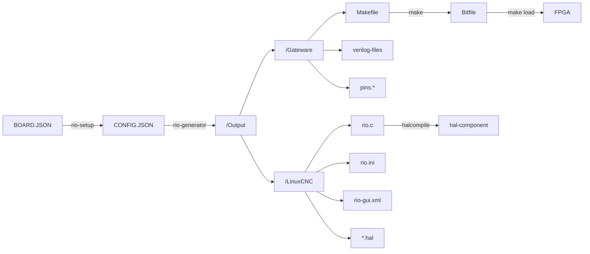

# How to control linuxcnc via FPGA board Cyclone II (EP2C5T144)

## software_requirement:

### 1st need to install quartus design software:

### Intel® Quartus® II Web Edition Software


## download link

https://www.intel.com/content/www/us/en/software-kit/711790/intel-quartus-ii-web-edition-design-software-version-13-0sp1-for-linux.html


## checksum

sha1sum Quartus-web-13.0.1.232-linux.tar

2b110eff0d544bcda4013e265f6feaa507482357  Quartus-web-13.0.1.232-linux.tar


# basic Study FPGA

https://www.youtube.com/watch?v=o29SnVsLhOs

https://www.youtube.com/watch?v=vmraRVxKYss


## How to install LinuxCNC-RIO

https://github.com/multigcs/LinuxCNC-RIO


#
```
git clone "https://github.com/multigcs/riocore.git"


python3 -m venv linuxRio
source linuxRio/bin/activate
```


##  Install Dependencies from requirements.txt

```
pip install -r requirements.txt 
pip install -r requirements-dev.txt
```


## RUN
```
PYTHONPATH=. bin/rio-setup
```


## Gathering PIN details from schematics.

**`push_button :`**

<p align="center">
  
</p>


**`led :`**

<p align="center">
  
</p>


# PINOUT


<p align="center">
  
</p>

<p align="center">
  
  
  
</p>

<p align="center">
  
</p>


## Flow <a name = "flow"></a>



