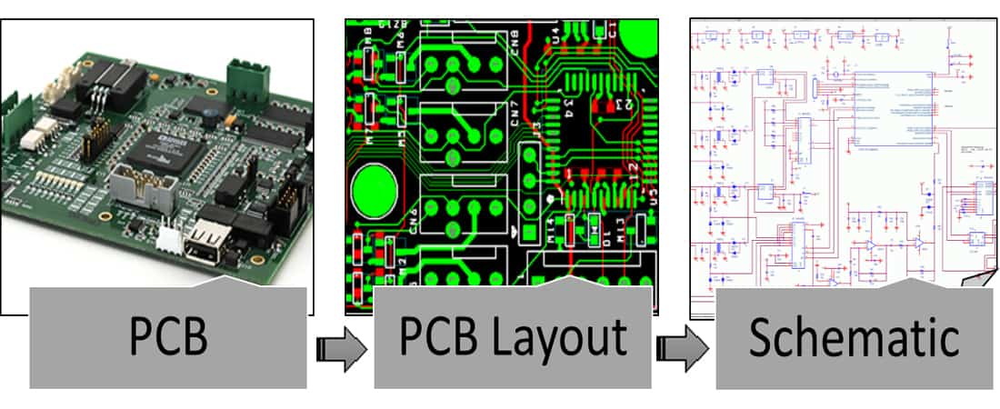
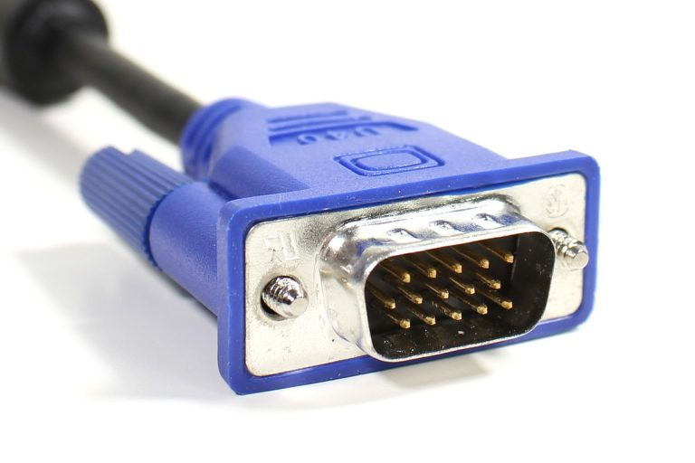
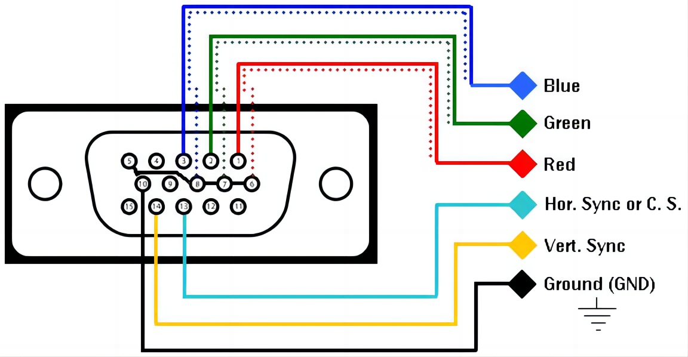
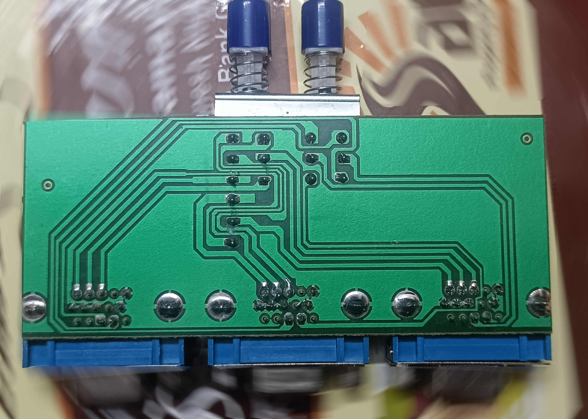
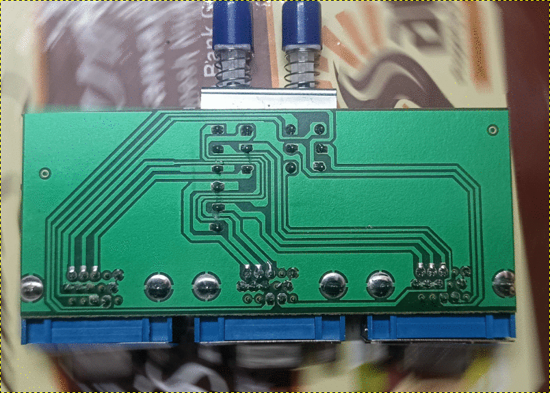
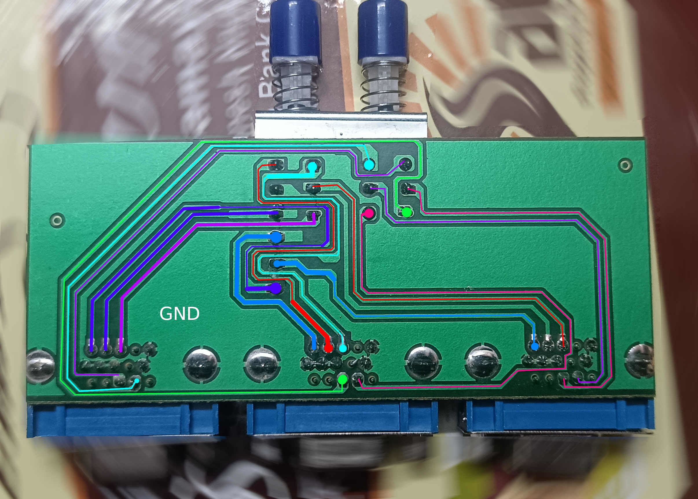
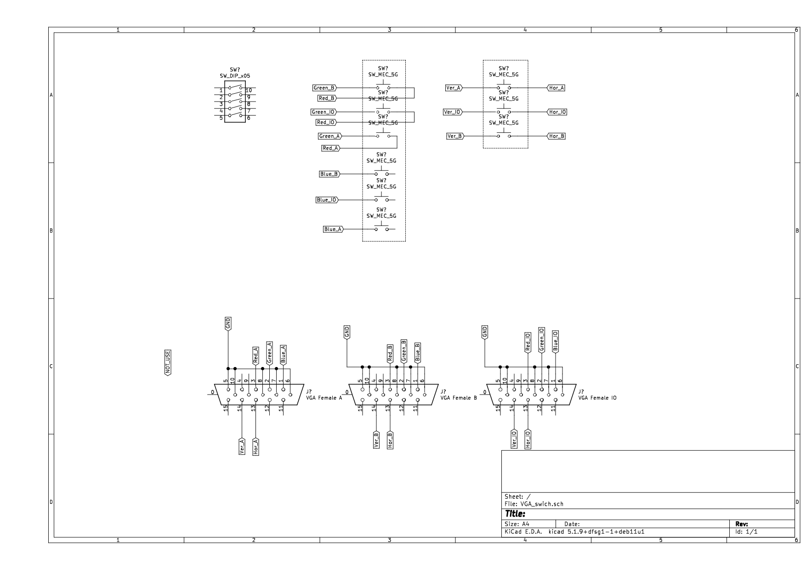

# PCB Clone ( single-sided)

**`Block Diagram:`**

**`VGA cable:`**

**`VGA_cable_pinout:`**

**`Source VGA Switch:`**

### I used GNU GIMP, then I drew it in the KiCad schematic.

**`pcb_trace:`**

**`pcb_trace:`**

Source_PCB_0.jpg

**`Kicad schematic:`**

# PCB Clone (double-sided)

Double-sided PCBs are a little tricky to clone, but they're not too difficult. I have a plan.

Required tools: 
Soldering iron and solder sucker
Soldering Station
Soldering Station
Liquid soldering flux 

First step: 
Remove all the components.

2 : 
Then remove the solder mask and silk screen using hydrogen peroxide.
Now you can see the copper track lines on the PCB board.

3 :
Capture high-quality images of the front and back sides of the PCB.

# notes: 
https://www.bristolwatch.com/pport2/cnc1.htm
https://www.electronics-lab.com/project/optically-isolated-lpt-breakout-board-for-cnc-routers/
https://www.electronics-lab.com/project/parallel-port-breakout-board-with-buffer-for-cnc-routers/
https://www.slideshare.net/slideshow/hy-jk02m-5axis-interface-board-manual/43935592
https://www.probotix.com/wiki/index.php/PBX-2
https://buildyourcnc.com/FAQ/9020
https://ve7it.cowlug.org/bob.html

https://oshwlab.com/Trevor8520/relay-isolated-i-o-sheet

https://www.cnczone.com/forums/cnc-machine-related-electronics/431380-cnc.html
https://www.machsupport.com/forum/index.php?topic=36647.0

https://hackaday.com/2023/08/11/grblhal-cnc-controller-based-on-rp2040-pico/

# extra
https://www.tindie.com/products/philba/grblhal-bob-unkit-for-teensy-41-t41u5xbb/
https://blog.protoneer.co.nz/arduino-cnc-shield/arduino-cnc-shield-schematics/
https://www.ubuy.ke/en/product/1RTSVMW-cnc-breakout-board-mach3-4-axis-6-axis-cnc-controller-motion-control-breakout-board-adapter-for-cnc-engraving-machine-cnc-lathe-cnc-plasma-cutting-mac

# ESP 32

https://oshwlab.com/meiko.gruenewald04/Esp-32-CnC-Controller

https://oshwlab.com/bdring/iso-external
https://oshwlab.com/search?wd=cnc&page=2
https://oshwlab.com/rd3d.gdl/CNC_Probe_Touch-201da7375d284fd98e77d4fc86970e67

# search -- > result +100
https://oshwlab.com/search?wd=%20CnC%20Controller

https://easyeda.com/modules?tags=Board&docType=schematic

MACH3
https://oshwlab.com/nikonpro/cnc-chpu

https://easyeda.com/modules?tags=Board&docType=schematic
https://hardware-cnc.nl/

